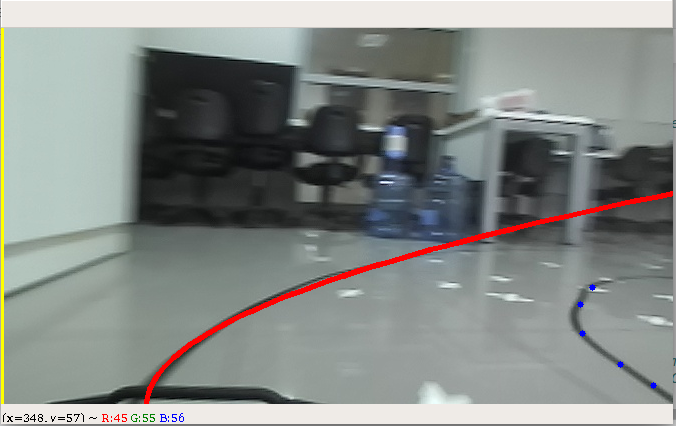

# Custom-Labeling-Framework
A labeling framework to create custom labels for your projects!

# What is this?
This is a simple script that can be edited easly to label images with custom labels.

# DISCLAIMER!!!!
THIS IS NOT A PROFESSIONALLY WRITTEN PROJECT. I AM NOT A SOFTWARE DEVELOPER. YOU WILL NEED TO DO CODE EDITING TO GET THIS WORKING WITH YOUR OWN LABELS (If you happen to use same labels as me, code works fine). PURPOSE OF THIS PROJECT IS TO GIVE MAIN FRAMEWORK SO YOU DON'T HAVE TO START FROM SCRATCH.

# But why?
There are many very good labeling tools such as [Scalabel](https://github.com/scalabel/scalabel) (Not a typo) and LabelIMG. But labels on these tools are predefined (Such as bounding box,poly points etc.) and if you want a different kind of label for your project, it is really hard to edit them. For our project, we wanted to label an image with polynomials. Thus we created our own tool. You can edit this script for your own cstom labels so you don't have to start from scratch. Labeling code is in jupyter notebook so you can edit and experiment easly.

# Required packages

This script requires:
* Jupyter notebook(For editing the code)
* Opencv
* Pandas

Tested on Ubuntu 18.04 and Python 3.7

# How to use

You need to do a little editing to adopt this project for your own custom labeling. We tried to comment the code as clearly as possible.

I'll explain the workflow for our project and you can make the required edits for your own application.
This project uses CSV files to store labels. In our project we wanted to fit two second polynomials for lane tracking application. Output of our network (Thus our labels) are the coefficients of the polynomials. So we have a total of 6 coefficients as our labels. So an example entry in our CSV file would look like

*/path/to/image ; coeff1 ; coeff2 ; coeff3 ; coeff4 ; coeff5 ; coeff6*

You can see an example labeling operation in the picture below. Normally you would use a reqion of interest for thi scenario but for the sake of simplicity we will go with this example. Notice a polynomail for the left lane is fit and drawn in red color and points for fittion right polinoial are set.

# Stap-1: Create an initial CSV file

For the first step we will create an initial CSV file. This file will store the paths to all our images and an initial label that will be overwritten later.

* Copy all your iamges to a folder. (Do not move or rename this folder from now on!!)
* Copy the path to the folder.
* Open up the *create_csv.py* script.
* Assign the path to your images folder to *root* variable.
* Change the initial label values with respect to your own requirements in line 14 inside *csv.write* fonction.
* Save and run the script.

This should create the CSV file.

# Step-2: Edit labeling script

Now that we have our CSV file containing all paths to our images and some initial label values to be overwritten later, we can open the *custom_labeler* script. 
The script is well commented (We hope) so you can easly understand how it works. Read  the code, understand it, maybe run it and play with it, then edit it for your own requirements
* Copy the created csv file to same directory of *custom_labeler* script
* Open up the script
* Read comments, understand code
* [Optional] Run the code and play with it
* Edit it based on your requirements
* Save and test it!!! (Test all functions before actual labeling)
* Label your images
* Use the same method in the script to pull your labels into our training script

